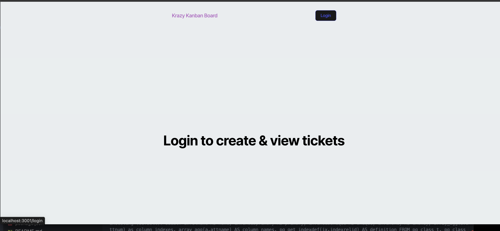

# Kanban Challenge

## Table of Contents
- [Installation](#installation)
- [Usage](#usage)
- [Contributing](#contributing)
- [Tests](#tests)
- [Questions](#questions)
- [License](#license)

## Description
Kanban is a great tool to manage your tasks! You can add new tasks, view your existing tasks, and delete your tasks.

## Installation
You must run npm i to install all necessary dependencies.

## Usage
To Login, you can click the login button at the top of the page and enter your credentials, as shown in the screenshots below.

From the login page, you can enter your credentials to sign into the site. For testing purposes, you can use the credentials listed below:
Username: JollyGuru
Password: password

Once you've logged in, you will see your ticket dashboard. Please see the screenshot below for a reference of what your dashboard should look like:

* From your dashboard, you will see the ability to add a new ticket, view tickets in progress, and view your completed tasks.
* To add a new ticket, you can click the black 'New Ticket' button, where you will be prompted to create a new ticket. 

* To Edit a task, you can click the 'edit' button where you will be prompted to enter the desired ticket name, ticket status, and ticket description.

* If you'd like to remove a ticket from your dashboard, simply click the 'Delete' button to remove the ticket.

* Once you're finished with your session in the application, you can click the Logout button at the top to log out of the application.

## Contributing
N/A

## Tests
The application can be tested by running npm test from the terminal.

## Questions
Message me on GitHub! [mcaiati2](https://github.com/mcaiati2)

## License
This project is listed under the MIT [License](https://opensource.org/licenses/MIT). You are free to use, modify, and distribute this software in accordance with the terms of the license. For more details, please refer to the LICENSE file in the repository.
